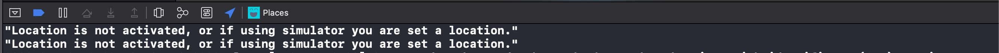
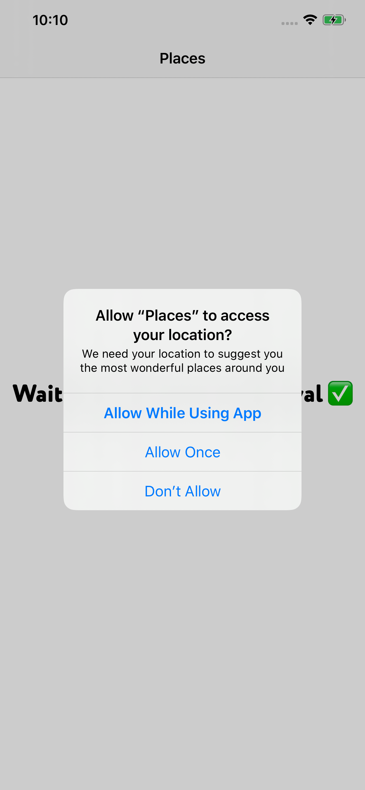
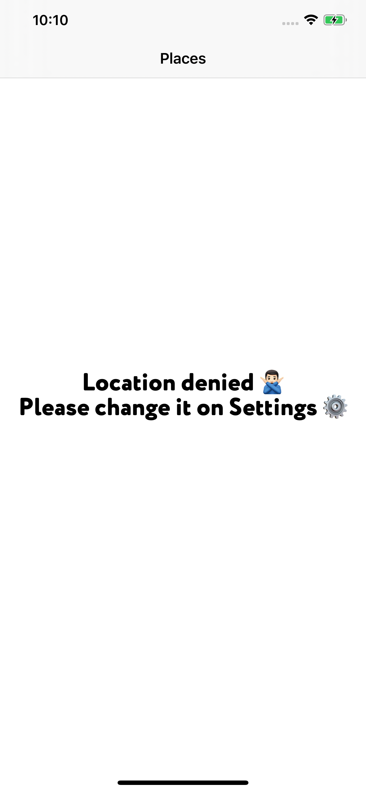
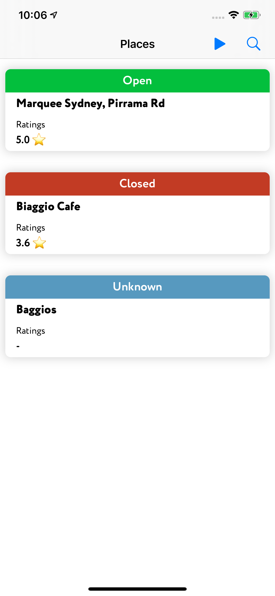
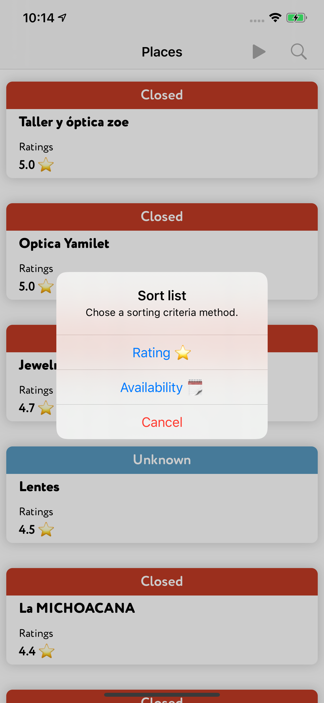
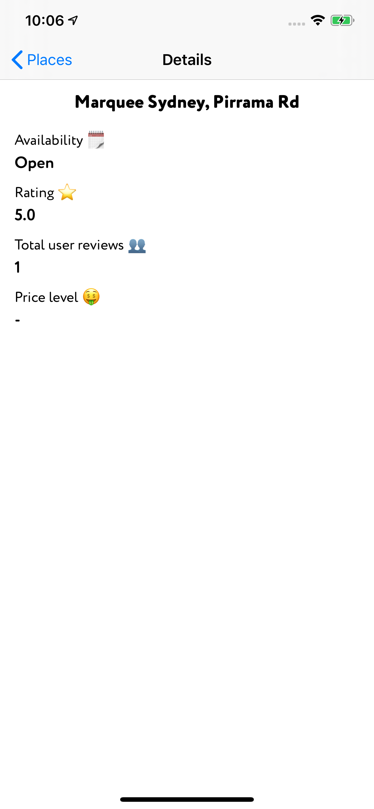

# Places app

## Description

Using the device location, fetch the nearby places using Google Places API and display a list of results.

## Requirements

* Fetch Nearby Places based on your Device Location;
* Use Google Places API endpoint.
  * Do NOT use any SDK or library that wraps the Places API;
  * Filter on Bars, Cafes & Restaurants;
* Provide Loading, Success and Error handling.
* Each place detail should display at least: Place, Name, Open now and Rating;
* Sort the list by Rating;
* When selecting a Place, provide a Detail View that holds additional information.
    * For example: Image or User Reviews.
* Extra: Provide additional sorting options, for example: Name, Open/Closed, Distance.

## Engineering instructions
* Developed in Swift, using an architectural design pattern of your choice;
* Provide relevant testing;
* Support for iOS11+, iPhone only.
* You can use any third party library that you want, given properly argumented.
* The choice for UI / UX is all yours. Be professional, but don’t spend too much time here.

## Documentation

⚠️ In order to run the app successfully, if running on simulator, make sure to enable location services at the beginning of the execution if possible for better results.

Once the app start running, you might be asked to share your location in order to fetch nearby places around you. App handle all the possible status of the location authorization with a view placeholder in case some action is needed on user side.

If location is granted it will fetch the nearby places around your location and will show a list of places. The information displayed it's the name, availability (wether is open, closed or unknown) and the rating if provided by the API.

In case request failed, or something goes wrong, there is a "Play" button on the top right of the screen which will retry fetching places from latest location.

Places can be sorted currently over two criterias: Rating and Availability. That will be achivable when pressing the "Magnifying glass" on the top right.

When tapping a place will show a new scene with extra details.

## Architecture

My decision for the architecture has been use **MVVM**. The reason behind that is that I am familiar with it and since the models from the API doesn't require high amount of modification in terms of getting presented, I didn't chose an approach as it could be **VIPER** or **VIP**. Also I use Repository for the Network layer (**MVVM-CR**).

Other patterns that I have used are **Coordinator pattern** for handling the navigation. **Factory pattern** in order to create dependencies in a way that can easily be tested. 

## Frameworks used

* **RxSwift & RxCocoa:** Benefits from RxSwift and RxCocoa are multiples as simplified Asynchronous declative code and multithreading, therefore you endup having a cleaner and more readable code and architecture. Allows composability. It's multi platform, which means if you learn it in Swift you will be able to use it in any other of the other languages that supports it (http://reactivex.io/languages.html). It's open source which means that has a huge community behind it, which means that likelihood of not being up to date it's unlikely. The downsides of this framework, which it's possible that will easily integrate all over the place in your aapp, are learning process at the beginning it's going to seem rough, but worth it on my opinion. Since you will be working with asynchronous code it might lead to memory leaks if not handled properly. Last one is debugging, usually has a big stack trace which make it sometimes hard to find the issue.

* **PKHUD:** I have used it for the loader. I didn't want to necessarily spend so many time on creating a loader since UI was important but not critical. I have had experience with this framework and it has really nice and easy integration.

* **SwiftLint & Swiftformat:** I have used it for giving format to code and be consistent all over the places with the styling.

* **RxTest & RxBlocking:** I have used them to test the stream of events generated for the views. 

* **SnapshotTesting:** I have used it for snapshot testing viewcontrollers, views, etc. Even though, my usage it's mainly for UI, it has really nice features to even snapshot server response!

## Future improvements

- [ ] Abstract loader
